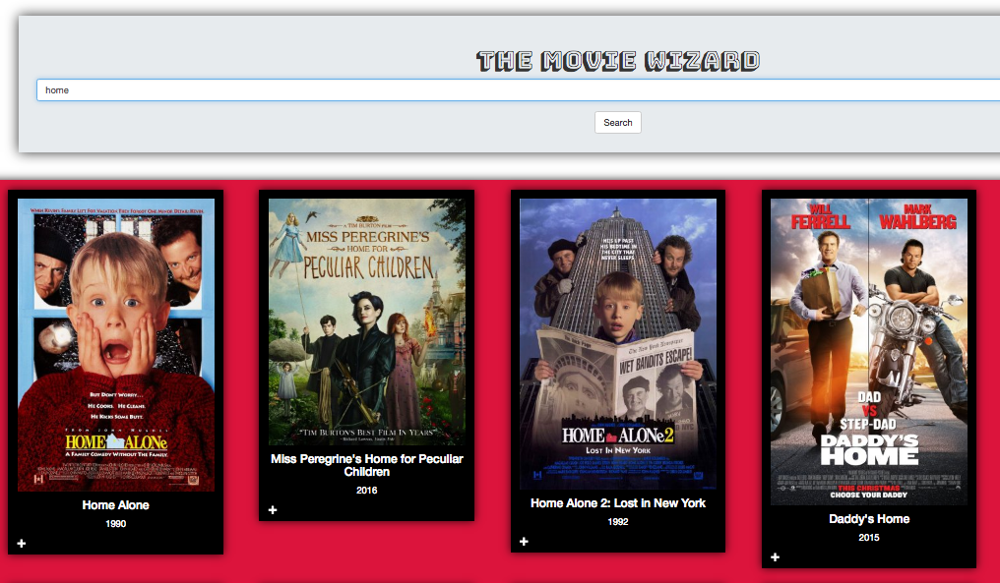
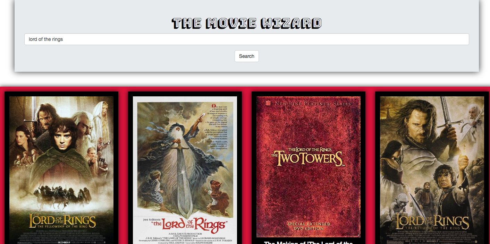
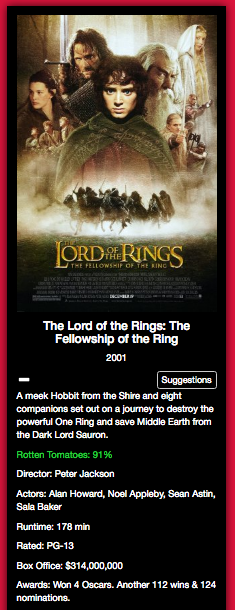

## Overview: The Movie Wizard is a web application that takes a movie title and presents relevant infomation along with suggestions for other titles you may like.  
  
##Website
www.movieswizard.com

##Languages used: 
  - HTML5
  - CSS
  - JavaScript(jQuery)
  
  APIs:
  - OMDB
  - TMDB
  
##MVP (Minimum Viable Product): 
Initial MVP
  - add input form
  - Connect OMDB API
  - get movie titles and posters from search
  - mobile first resposive design
  
Strech Goals
  - add suggestions button
  - add support for different media types i.e. video games
  - implement some form of AI to suggest titles 
  - add new or upcoming titles
  
Challenges & Solutions:
Some of the biggest challenges I faced with this project build included: 

  - Handling some large promise chains and rendering the content to the webpage in a timely manner.  
    Solution: Using Promise.All() to handle the asynchronous callbacks.

  - Making up for the shortfalls of my API and tying in another. 
    Solution: Discovered the TMDB API and used that to populate the suggestions

  - Styling:
    Solution: Styling the elements is still unfinished, ideally I would like to add some sort of carousel for the titles and make the "Suggestions" populate in a different way for larger viewports.
  
##Code Snippets
```
//Below is the main search function that occurs on form submit 
$THE_FORM.on('submit', function(event) {
    event.preventDefault();
    $SEARCH_RESULTS.empty();
    var titleData = $TITLE.val();
    if (titleData !== "") {
        getServerData(titleData)
            .then(function(data) {
                presentServerData(data);
            })
        }
    if (titleData === "") {
        alert('Please input a movie title.');
            }
        }    
);
```

##Screenshots

This is a shot of an example search


This is a shot of the relevant movie info that is presented.

##Project History
Started: 07/24/17
